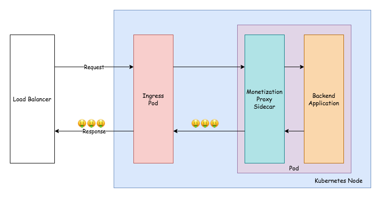

# web-monetization-proxy
Simple proxy for injecting [Web Monetization](https://webmonetization.org/) `meta` tags. Intended to be deployed as a sidecar process alongside Web Monetization unaware webapps.

This proof-of-concept project was created for fun as part of the [DEV "Grant For The Web" Hackathon](https://dev.to/devteam/announcing-the-grant-for-the-web-hackathon-on-dev-3kd1).



## configuration
The proxy relies on the following environment variables:
* `PROXY_PORT` -- the port the proxy listens on
* `BACKEND_PORT` -- the port of the backend application that requests are forwarded to
* `PAYMENT_POINTER` -- an [Interledger Payment Pointer](https://paymentpointers.org/) string

Reference the [example Deployment](hack/example-deployment.yaml) to see how you might configure these in Kubernetes.

## development
This project uses [Go modules](https://blog.golang.org/using-go-modules) which work best with Golang 1.13+. To run the project's tests, run `go test ./...` from the root directory.

## build and deployment


This project uses [Cloud Native Buildpacks](https://buildpacks.io/) and the [`pack` cli](https://buildpacks.io/docs/install-pack/) in lieu of a `Dockerfile`. New images can be built by running the following:

```console
pack build <image-name-here> -B cloudfoundry/cnb:bionic
```

To ease development and deployment to Kubernetes, it also includes some [`kbld`](https://get-kbld.io/) configuration in the `build` directory and a sample Kubernetes `Deployment` in the `hack` directory.

To quickly build, push, and deploy to Kubernetes run<sup>1</sup>:

```console
kbld -f hack -f build | kubectl apply -f -
```

_<sup>1</sup> - You will need to update `build/destinations.yaml` to refer to an OCI image registry you have permission to push to and replace `hack/example-ingress.yaml` with `Ingress` configuration that is valid for your cluster._
